## Arquitectura de Software (GRUPO 5)

#### INTEGRANTES 

- GUAMIALAMA NICOLAS
- RODRIGUEZ BETTY 
- VILLAMARIN VICTOR
- DOMINGUEZ OSCAR
- POAQUIZA MARCO
- TENEMAZA ALANIS


# Sistema de Citas Médicas (SCM)

Sistema de gestión de citas médicas desarrollado con Laravel nos permite administrar pacientes, doctores, especialidades, consultorios, citas, historiales médicos y tratamientos.

## Requisitos del Sistema

- PHP >= 8.2
- Composer
- MySQL >= 5.7
- Node.js >= 16.x y NPM

## Instalación y Despliegue

### 1. Clonar el Repositorio
```bash
gh repo clone saoricoder/SCM_G5_AS
cd SCM_G5_AS
```

### 2. Instalar Dependencias
```bash
# Dependencias de PHP
composer install

# Dependencias de Node.js (opcional, para assets)
npm install
```

### 3. ACTUALIZAR MIGRACIÓN DE USUARIOS
```bash
 # Campos adicionales para Citas Médicas
            $table->date('fecha_nacimiento')->nullable();
            $table->enum('sexo', ['Masculino', 'Femenino', 'Otro'])->nullable();
            $table->string('numero_seguro')->nullable();
            $table->text('historial_medico')->nullable();
            $table->string('contacto_emergencia')->nullable();
            $table->enum('role', ['admin', 'doctor', 'paciente', 'recepcionista'])->default('paciente');
```

### 4. ACTUALIZAR MODELO USER

Editar el archivo /Models/User.php:
```class User extends Authenticatable
{
    use HasApiTokens, HasFactory, Notifiable;

    protected $fillable = [
        'name',
        'email',
        'password',
        'fecha_nacimiento',
        'sexo',
        'numero_seguro',
        'historial_medico',
        'contacto_emergencia',
        'role'
    ];

    protected $hidden = [
        'password',
        'remember_token',
    ];

    protected $casts = [
        'email_verified_at' => 'datetime',
        'fecha_nacimiento' => 'date',
    ];

#  Relaciones según sea necesario
    public function citasComoPaciente()
    {
        return $this->hasMany(Cita::class, 'paciente_id');
    }
```

### 5.  INSTALAR LARAVEL SANCTUM


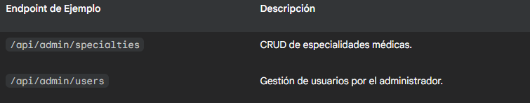


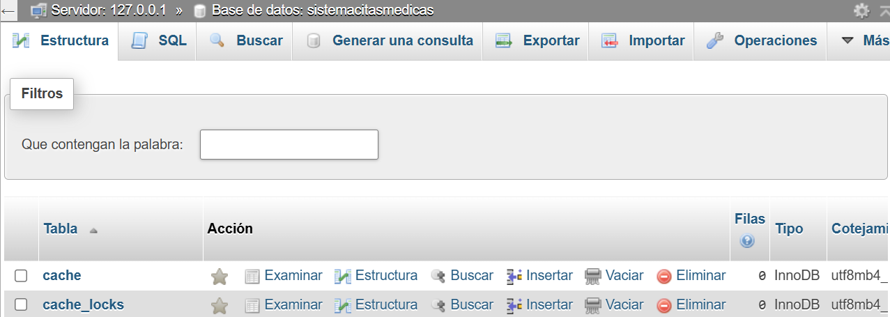

### CREAR CONTROLADOR DE USUARIOS API

```
Controllers/API/UserController.php
```
### CREAR CONTROLADOR DE AUTENTICACIÓN

```
Controllers/API/AuthController.php
```
### CONFIGURAR RUTAS API

```
routes/api.php
```

#### Ruta de verificación de salud del microservicio
```
Route::get('/health', function () {
    return response()->json([
        'status' => 'success',
        'message' => 'Microservicio de Gestión de Usuarios funcionando correctamente',
        'timestamp' => now()->toDateTimeString()
    ]);
});
````
### CREAR SEEDER PARA USUARIOS


```
seeders/UsersSeeder.php
```

### 6. Ejecutar Migraciones y Seeders
```bash


php artisan make:migration create_especialidades_table
php artisan make:migration create_doctores_table
php artisan make:migration create_pacientes_table
php artisan make:migration create_consultorios_table
php artisan make:migration create_citas_table
php artisan make:migration create_historial_medico_table
php artisan make:migration create_tratamientos_table

# Ejecutar migraciones
php artisan migrate:fresh


```
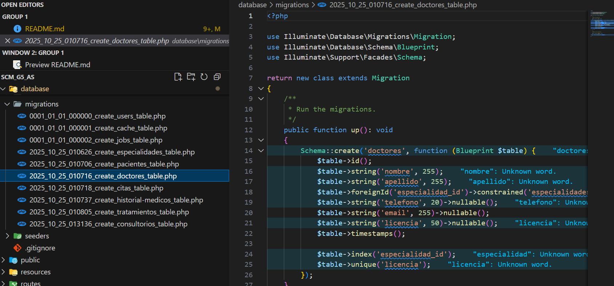
```bash 
# Creacion de los Modelos

php artisan make:model Especialidad
php artisan make:model Doctor
php artisan make:model Paciente
php artisan make:model Consultorio
php artisan make:model Cita
php artisan make:model HistorialMedico
php artisan make:model Tratamiento
# Poblar base de datos con datos de prueba
php artisan db:seed
```
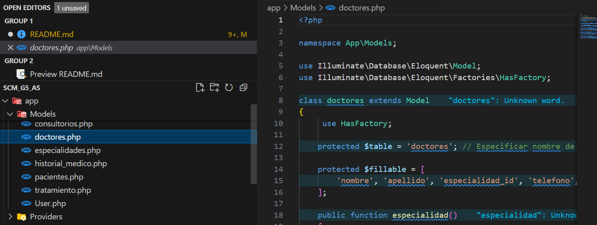


### 7. Configurar Rutas API
El proyecto incluye rutas API que están configuradas en `bootstrap/app.php`. Las rutas están disponibles en:
- `/api/stats` - Estadísticas del dashboard
- `/api/citas` - Gestión de citas
- `/api/pacientes` - Gestión de pacientes
- `/api/doctores` - Gestión de doctores
- `/api/especialidades` - Gestión de especialidades

Ahora podemos probar TODAS las rutas API:
•	http://127.0.0.1:8000/api/pacientes
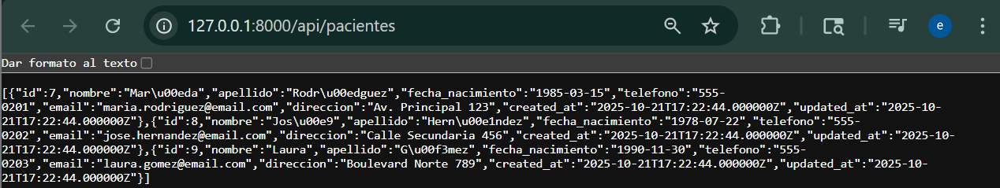

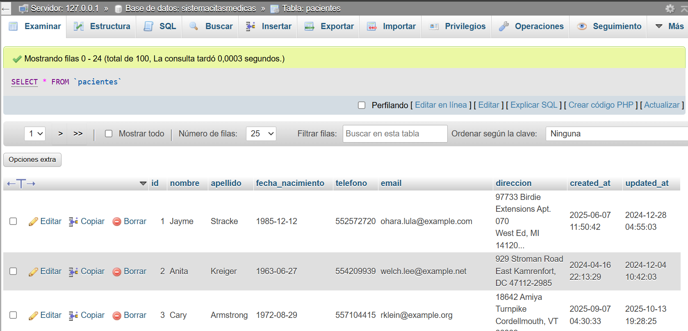

•	http://127.0.0.1:8000/api/especialidades

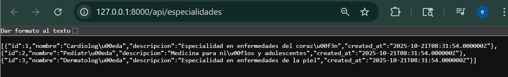

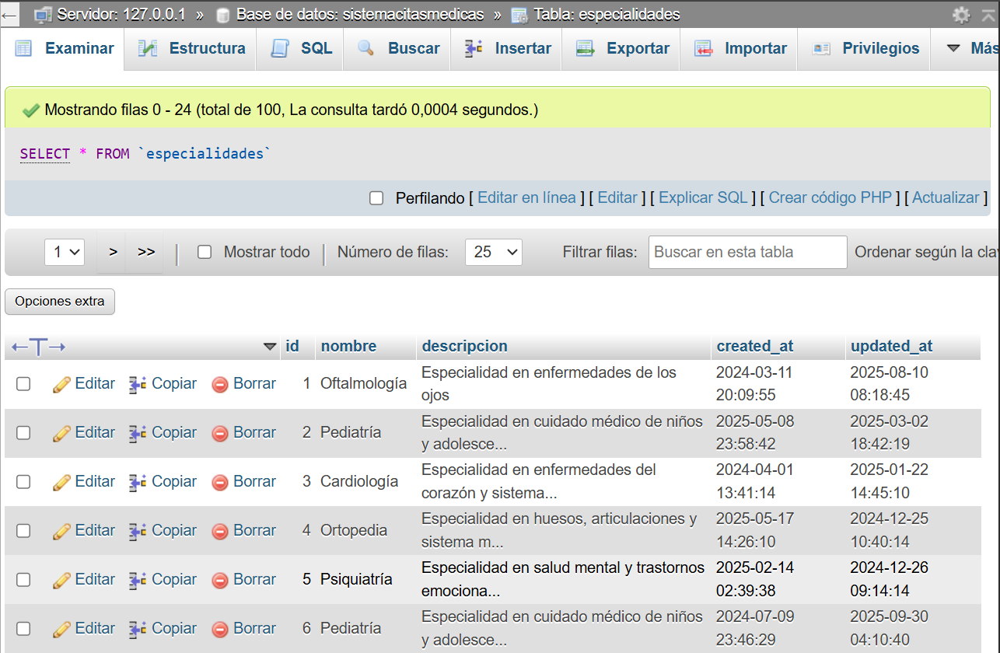

•	http://127.0.0.1:8000/api/historial-medico
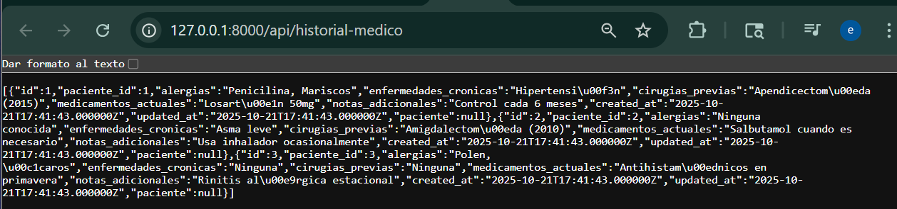

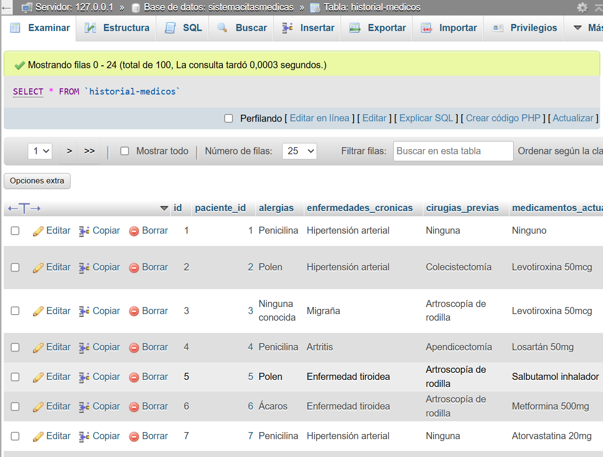

•	http://127.0.0.1:8000/api/consultorios

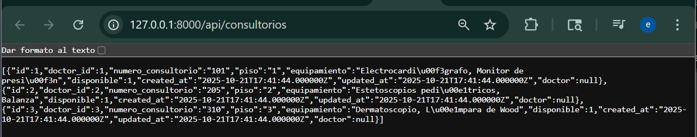

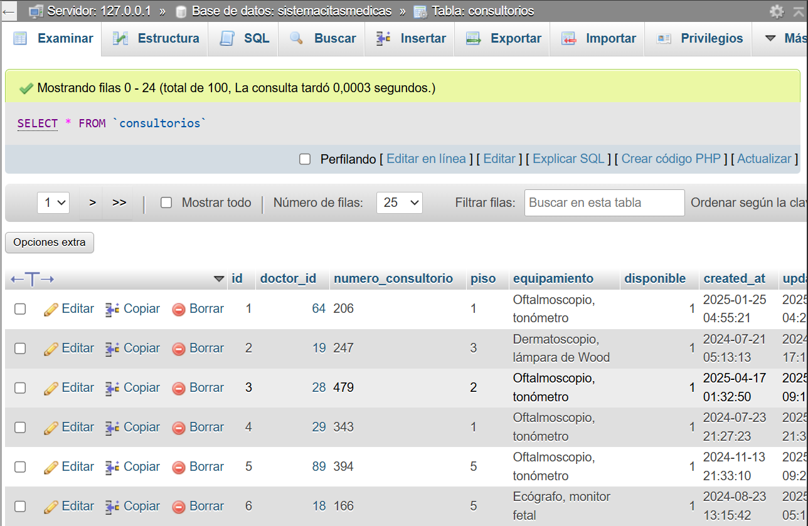
•	http://127.0.0.1:8000/api/tratamientos

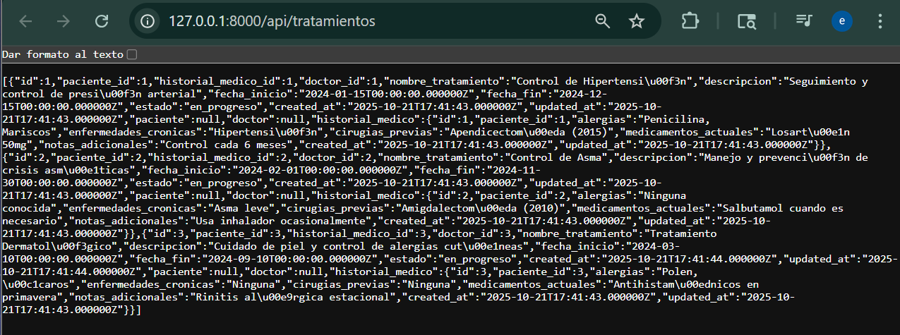

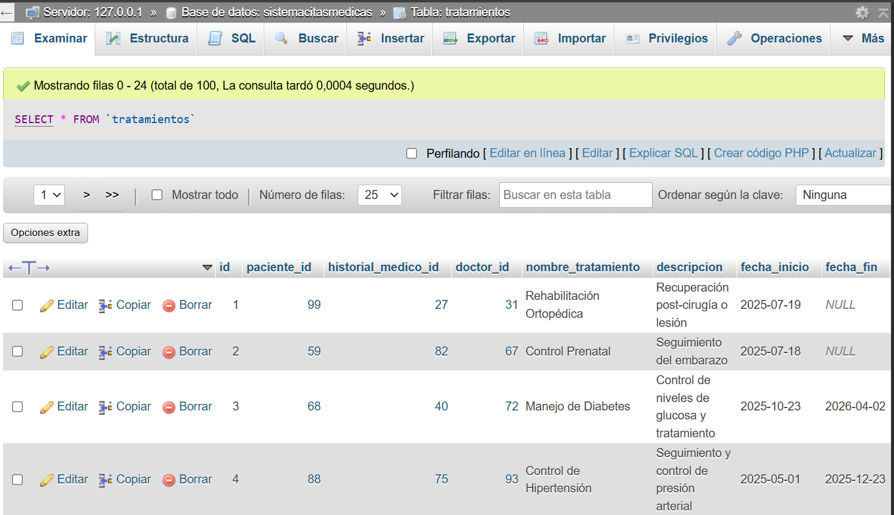

## Ejecución del Proyecto

### Servidor de Desarrollo
```bash
php artisan serve
```

La aplicación estará disponible en: `http://127.0.0.1:8000`
 http://localhost:8080

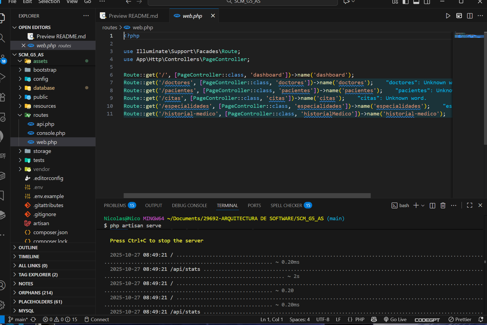

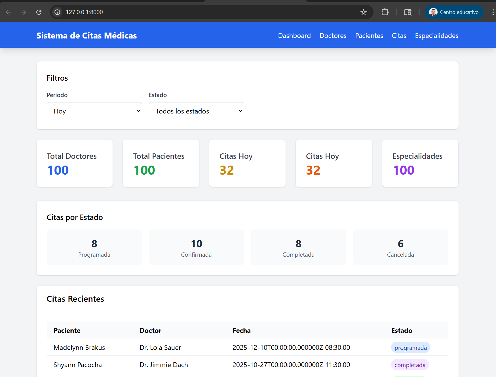

### Verificar Instalación
```bash
# Listar rutas disponibles
php artisan route:list

# Verificar estado de la base de datos
php artisan migrate:status
```

## Estructura de Rutas Principales

### Rutas Web
- `/` - Dashboard principal
- `/pacientes` - Gestión de pacientes
- `/doctores` - Gestión de doctores
- `/especialidades` - Gestión de especialidades
- `/citas` - Gestión de citas
- `/historial-medico` - Historiales médicos

### Rutas API
- `GET /api/stats` - Estadísticas del sistema
- `GET /api/citas` - Lista de citas
- `GET /api/pacientes` - Lista de pacientes
- `GET /api/doctores` - Lista de doctores
- `GET /api/especialidades` - Lista de especialidades

## Modelos del Sistema

- **User** - Usuarios del sistema
- **Pacientes** - Información de pacientes
- **Doctores** - Información de doctores
- **Especialidades** - Especialidades médicas
- **Consultorios** - Consultorios disponibles
- **Citas** - Citas médicas programadas
- **Historial_medico** - Historiales médicos
- **Tratamiento** - Tratamientos médicos

## Solución de Problemas Comunes

### Error de Rutas API no Encontradas
Si las rutas `/api/*` devuelven 404, verificar que `bootstrap/app.php` incluya:
```php
->withRouting(
    web: __DIR__.'/../routes/web.php',
    api: __DIR__.'/../routes/api.php',
    commands: __DIR__.'/../routes/console.php',
    health: '/up',
)
```

### Error de Relaciones en Modelos
Verificar que las claves foráneas estén correctamente definidas en las relaciones:
- `especialidades.php`: `hasMany(doctores::class, 'especialidad_id')`
- `doctores.php`: `belongsTo(especialidades::class, 'especialidad_id')`

### Permisos de Archivos (Linux/Mac)
```bash
chmod -R 755 storage bootstrap/cache
chown -R www-data:www-data storage bootstrap/cache
```

## Comandos Útiles
```bash
# Limpiar caché
php artisan cache:clear
php artisan config:clear
php artisan view:clear

# Regenerar autoload
composer dump-autoload

# Verificar configuración
php artisan config:show database
```
## Clonar el Repositorio

- Instalar Git: Asegúrate de tener Git instalado en tu computadora. Puedes descargarlo desde git-scm.com.

- Copiar la URL: Copia la URL del repositorio: https://github.com/saoricoder/SCM_G5_AS.git.

- Abrir la Terminal/Línea de Comandos: Navega hasta la carpeta en tu computadora donde quieres guardar el proyecto.

- Ejecuta el siguiente comando:  
  git clone https://github.com/saoricoder/SCM_G5_AS.git
- Esto creará una nueva carpeta llamada SCM_G5_AS  con todos los archivos
